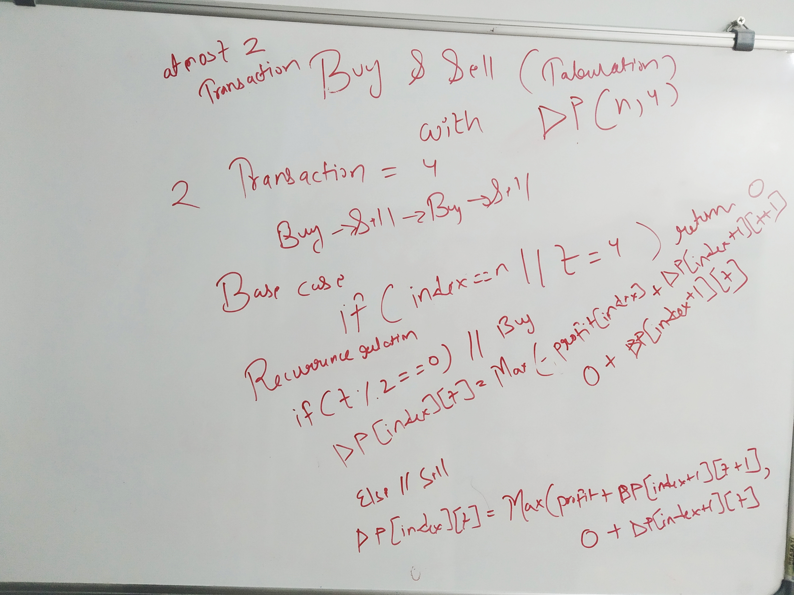
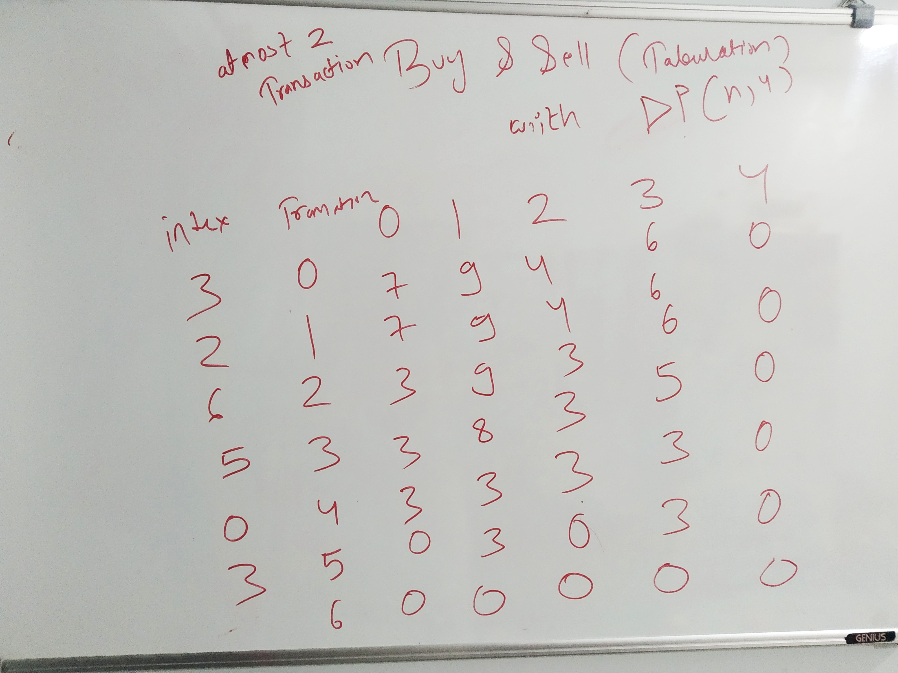

[Leet code question](https://leetcode.com/problems/best-time-to-buy-and-sell-stock-iii/)

```
var profit = (prices, index, canBuy, cap, memo = {}) => {
    if ( `${index}${canBuy}${cap}` in memo ) return memo[`${index}${canBuy}${cap}`]
    
    if (cap == 0) return 0;
    
    if (index == prices.length) return 0;
    
    let prof = 0;
    
    if(canBuy) {
        prof = Math.max(-prices[index] + profit(prices, index + 1, false, cap, memo),
                          0 + profit(prices, index + 1, true, cap, memo));
        memo[`${index}${canBuy}${cap}`] = prof
                         
    }
     else {
        prof = Math.max(prices[index] + profit(prices, index + 1, true, cap-1, memo),
                          0 + profit(prices, index + 1, false, cap, memo))
         memo[`${index}${canBuy}${cap}`] = prof
     }
    
    return prof;
}

```

**Buy and sell tabulation diagram with code and with DP of (n, cap*2) or dp(n,4)**





